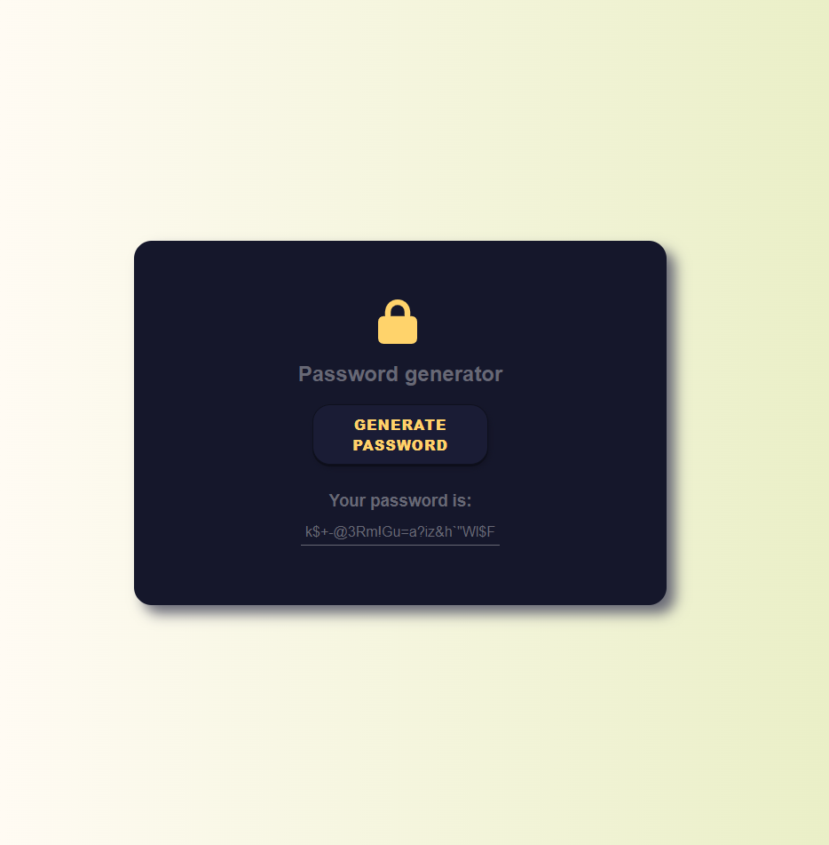
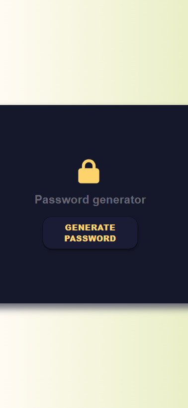

# Password Generator

## Description 

I'll create a Password generator app that runs in the browser and features dynamically updated HTML and CSS, all powered by JavaScript code that I will write. My app will have a clean and polished user interface that is responsive, ensuring that it adapts to multiple screen sizes.

The password can include special characters.

## Table of Contents

* [User Story](#User-Story)
* [Acceptance Criteria](#Acceptance-Criteria)
* [Mock-Up](#Mock-Up)
* [Colours Used](#Colours-Used)
* [Technical Acceptance Criteria: 40%](#Technical-Acceptance-Criteria-40)
* [Deployment: 32%](#Deployment-32)
* [Application Quality: 15%](#Application-Quality-15)
* [Repository Quality: 13%](#Repository-Quality-13)
* [Badges🏆](#Badges)

## User Story

```
I'm required to create an application that an employee can use to generate a random password based on criteria they’ve selected by modifying starter code.
```

## Acceptance Criteria

My application must:

- [x] Generate a password when the button is clicked  
- [x] Present a series of prompts for password criteria:  
  - [x] Length of password (between 8 and 128 characters)  
  - [x] Character types:  
    - [x] Lowercase (```abcdefghijklmnopqrstuvwxyz```)  
    - [x] Uppercase (```ABCDEFGHIJKLMNOPQRSTUVWXYZ```)  
    - [x] Numeric (```0123456789```)  
    - [x] Special characters (``` !"#$%&'()*+,-./:;<=>?@[\]^_`{|}~```)  
- [x] Code should validate for each input and at least one character type should be selected  
- [x] Once all prompts are answered, the password should be generated and displayed in an alert or written to the page  

## Mock-Up

The following image shows the web application's appearance and functionality:
  

  

## Colours Used:
-  `#15172B`
-  `#FFFBF3`
-  `#EAEFC7`
-  `#FFD26B`
-  `#FFFBF3`
-  `#676875`
-  `#1A1C35`
-  `#0E101D`
-  `#0D0E1A`
-  `#121426`
-  `#333869`
-  `#05060A`

---
## Technical Acceptance Criteria: ```40%```

- Satisfies all of the above acceptance criteria plus the following:  
  - The Challenge should not produce any errors in the console when you inspect it using Chrome DevTools.

## Deployment: ```32%```

- Application deployed at live URL.

- Application loads with no errors.

- Application GitHub URL submitted.

- GitHub repository that contains application code.

## Application Quality: ```15%```

- Application user experience is intuitive and easy to navigate.

- Application user interface style is clean and polished.

- Application resembles the mock-up functionality provided in the Challenge instructions.

## Repository Quality: ```13%```

- Repository has a unique name.

- Repository follows best practices for file structure and naming conventions.

- Repository follows best practices for class/id naming conventions, indentation, quality comments, etc.

- Repository contains multiple descriptive commit messages.

- Repository contains quality README file with description, screenshot, and link to deployed application.


## Badges🏆


---

Elvis Stiglic © 2023